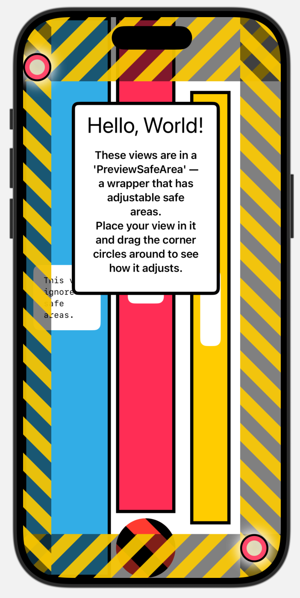
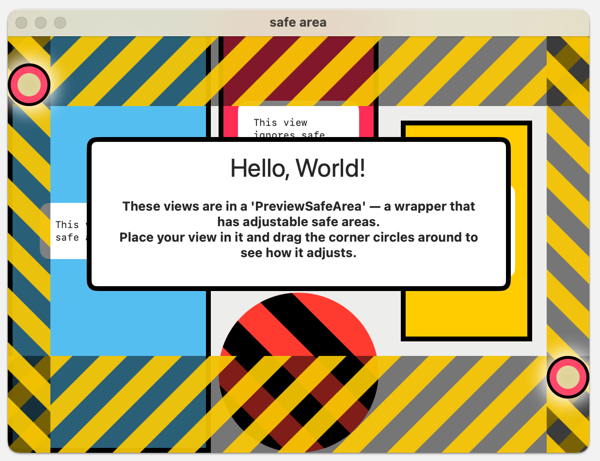
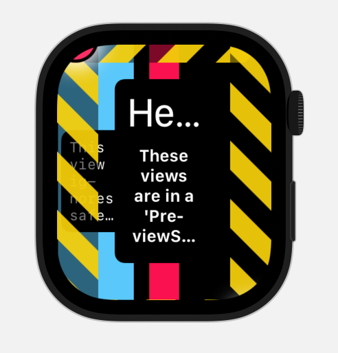

#  PreviewSafeArea

`PreviewSafeArea` visualizes safe areas and makes them resizable at runtime.
Place your view in it and drag the circular handles in the corners to test your layout.


## Usage:

Import the library:
```
.package(url: "https://github.com/adam-zethraeus/previewsafearea", version: "1.0.0")
```

Place your view in the helper:
```swift
  PreviewSafeArea {
    MyView()
  }
```

## Screenshots


| iOS  | macOS  | watchOS  |
|---|---|---|
|  |  |  |
